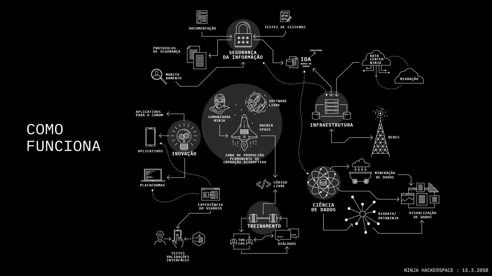

## 🤖 Manifesto Hacker Space

1. Somos hackerativistas na construção de um mundo melhor.
2. Lutamos pela equidade e por um ambiente livre de assédio, de qualquer tipo, seja da aparência pessoal, deficiência, etnia, idade, identidade ou expressão de gênero, identidade ou orientação sexual, nacionalidade, nível de experiência, porte físico, raça ou religião.
3. Lutamos pela abertura para o debate antirracista e construção de um espaço seguro LGBT.
4. Tudo é possível. Aqui a lógica é solidária e colaborativa, o que você vive lá fora fica lá fora.
5. Reunimos recursos humanos e inteligência coletiva.
6. Somos entusiastas e praticantes do software livre.
7. Somos atentos às questões da Segurança dos Dados e da Privacidade.
8. Temos lado e somos livres de julgamentos morais.
9. Se chegou agora, ouça.
10. Acreditamos que só o amor salva.

## 🕊 Código de Conduta

O time da NINJA Hacker NINJA se compromete a promover um ambiente livre de assédio para todas as pessoas. Não será tolerada qualquer forma de assédio ou intimidação em seu espaço físico ou eventos. Por assédio entende-se comentários ofensivos, verbais ou eletrônicos, relacionados a características ou escolhas pessoais, origem racial, gênero, bem como comentários ou imagens sexuais, racistas, homofóbicas, transfóbicas ou discriminatórias de qualquer natureza em espaços públicos ou digitais, intimidação deliberada, bullying, perseguição, fotografias ou gravações que gerem embaraço. Se você for assediado(a) ou perceber que alguém está sendo assediado(a), por favor entre em contato com nossos responsáveis para que medidas cabíveis sejam tomadas. Este Código de Conduta foi adaptado a partir dos códigos de conduta utilizados pela Wildtech e estão licenciados sob a Creative Commons Attribution-Share Alike 3.0 Unported.

## Áreas de Trabalho

1. Inovação 
2. Infraestrutura 
3. Ciência de Dados 
4. Segurança da Informação 
5. Experiência do Usuário 
6. Maker
7. Formação Hacker 
8. Sistematização

## 👩‍💻 Stack

Python
Django
Django rest framework
ReactJS
NodeJS

## 👩‍💻 Infra

Serverless api's

MongoDB

MySQL

s3 (storage)

## 🦖 Repositórios

[https://github.com/midianinja](https://github.com/midianinja)

[https://github.com/foradoeixo](https://github.com/foradoeixo)

## 🖖 Hacker Aqui

Pra começar, coloque seus dados no nosso **banco de habilidades**. Vamos te conhecer melhor e ter no radar pra te acessar para projetos, além de convite para encontros pelo país!

[https://docs.google.com/forms/d/e/1FAIpQLScMHtAJvIp39oryyQsovEKAayU_RFndSxtcdEiz7Kc6jk5wHA/viewform](https://docs.google.com/forms/d/e/1FAIpQLScMHtAJvIp39oryyQsovEKAayU_RFndSxtcdEiz7Kc6jk5wHA/viewform)

## 🌐 Projetos / 40 Redes

[Candidate-se](https://www.notion.so/Candidate-se-d28ec5eb55aa44b6b19099235232944c)

[Portal NINJA](https://www.notion.so/Portal-NINJA-5038b58347f74873a99e42246552fe3c)

[NINJA Software House](https://www.notion.so/NINJA-Software-House-b8031e8f297b48f3bbb4cfe0db7e5a1b)

[Ecossistema de Tecnologia ](https://www.notion.so/Ecossistema-de-Tecnologia-1f5b0ccc26d345aea18229142b67289b)

[Modo de Organização do H.S ](https://www.notion.so/Modo-de-Organiza-o-do-H-S-6456faecd26b4fe0a682e181fcc71232)
